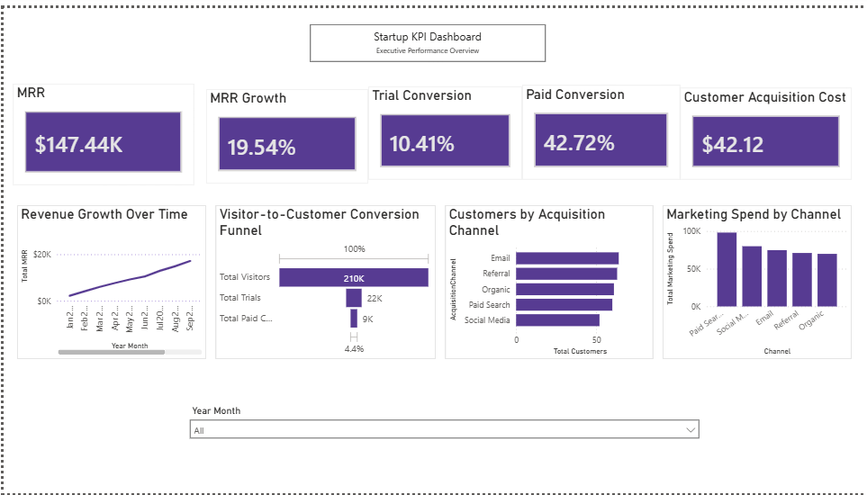

Startup KPI Dashboard

An interactive Power BI dashboard designed to monitor startup performance through revenue, customer acquisition, conversion, and marketing KPIs.

---

Business Problem

Startup founders need a centralized view of business performance to make informed decisions. This dashboard brings together key metrics into a single interactive report.

---

Project Objective

Build an executive dashboard that tracks:

- Monthly Recurring Revenue (MRR)
- Revenue Growth
- Customer Acquisition Cost (CAC)
- Trial Conversion Rate
- Paid Conversion Rate
- Marketing Performance

---

Tools Used

- Power BI
- Power Query
- DAX
- Data Modeling
- Microsoft Excel

---

Dashboard Previe

Key KPIs

- Monthly Recurring Revenue (MRR)
- Revenue Growth
- Customer Acquisition Cost (CAC)
- Trial Conversion Rate
- Paid Conversion Rate
  
---

Repository Contents

- Power BI Dashboard (.pbix)
- Dataset (.csv)
- Project Presentation (.pdf)

---

Key Insights

- Monthly Recurring Revenue reached **$147.44K**
- Revenue grew by **19.54%**
- Trial Conversion Rate: **10.41%**
- Paid Conversion Rate: **42.72%**
- Customer Acquisition Cost: **$42.12**

---

Author: Osazuwa Blessing

**Blessing Osazuwa**

Business Analytics Portfolio
